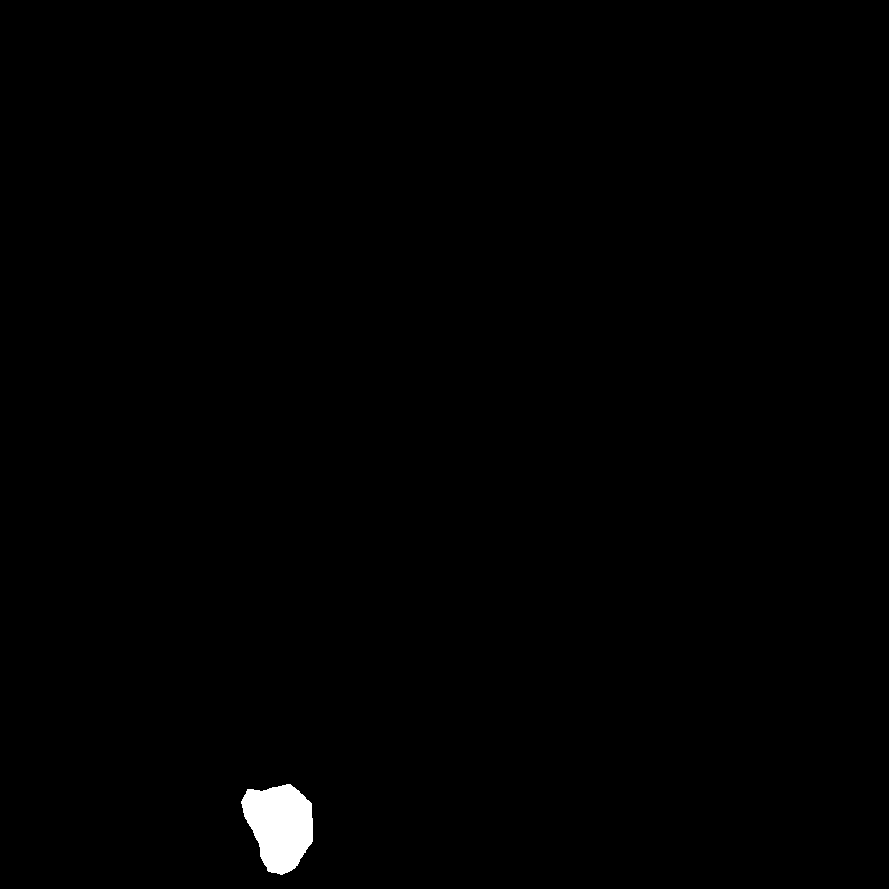
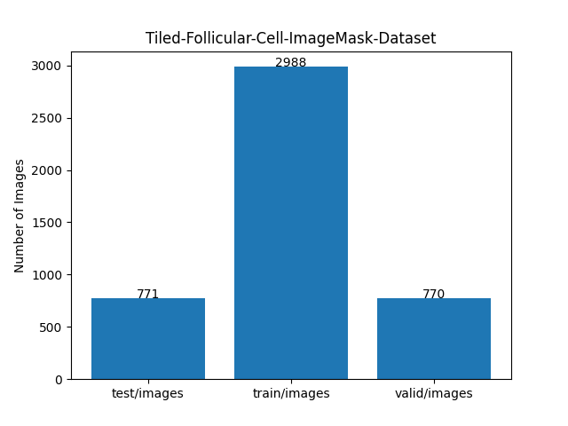

<h2>Tiled-ImageMask-Dataset-Follicular-Cell (Updated:2024/09/29)</h2>
<li>
2024/09/29: Added <a href="https://drive.google.com/file/d/1ISpL9l-Dv8k93BrqGb0V0vaab9TrQP5U/view?usp=sharing">
Tiled-Follicular-Cell-ImageMask-Dataset-V2.zip</a>
</li>
 
This is Tiled ImageMask Dataset for Follicular-Cell<a href="https://github.com/bupt-ai-cz/Hybrid-Model-Enabling-Highly-Efficient-Follicular-Segmentation">
Hybrid-Model-Enabling-Highly-Efficient-Follicular-Segmentation</a>
 
The original Follicular-Cell Patch Dataset can be downloaded from the google drive 
<a href="https://drive.google.com/file/d/1t1W7tpKscqLxPApqH3JSP_zsljLHWKxQ/view?usp=sharing">IM_PatchDataset.zip</a>.
 
 

<b>Download Tiled-ImageMask-Dataset</b> 
You can download our dataset from the google drive: 
<a href="https://drive.google.com/file/d/1Muvzh0nzaqhYvYF1iUwfHGSGIXq0bQG3/view?usp=sharing">
Tiled-Follicular-Cell-ImageMask-Dataset.zip</a>
 
 
<b>Download Tiled-ImageMask-Dataset V2</b> 
You can download our dataset from the google drive: 
<a href="https://drive.google.com/file/d/1ISpL9l-Dv8k93BrqGb0V0vaab9TrQP5U/view?usp=sharing">
Tiled-Follicular-Cell-ImageMask-Dataset-V2.zip</a>, which was derived from training_set only wthout testing set.
 
Probably, this dataset is more suitable for a real train-eval process of a segmentation model.
 

<h3>1. Dataset Citation</h3>
Please cite these papers in your publications if it helps your research: 
<a href="https://www.sciencedirect.com/science/article/pii/S2667102621000036">
<b>pdf of Intelligent Medicine</b>
</a>
<pre>
@article{zhu2021hybrid,
  title={Hybrid model enabling highly efficient follicular segmentation in thyroid cytopathological whole slide image},
  author={Zhu, Chuang and Tao, Siyan and Chen, Huang and Li, Minzhen and Wang, Ying and Liu, Jun and Jin, Mulan},
  journal={Intelligent Medicine},
  year={2021},
  publisher={Elsevier}
}
</pre>
License: This data can be freely used for academic purposes. (non-commercial)
 
 
<h3>2. Download Follicular-Cell</h3>

If you would like to create Follicular Cell ImageMask Dataset by yourself,
please download the original PatchDataset from the google drive 
<a href="https://drive.google.com/file/d/1t1W7tpKscqLxPApqH3JSP_zsljLHWKxQ/view?usp=sharing">IM_PatchDataset.zip</a>.
 
It contains the following testing set and training set of 1024x1024 pixels png files. 
<pre>
./patch dataset
├─testing set
│  ├─data
│  │  ├─background
│  │  ├─jiaozhi
│  │  └─lvpao
│  ├─label
│  │  ├─background
│  │  ├─jiaozhi
│  │  └─lvpao
│  └─label_transfered
│      ├─background
│      ├─jiaozhi
│      └─lvpao
└─training set
    ├─data
    │  ├─background
    │  ├─jiaozhi
    │  └─lvpao
    ├─label
    │  ├─background
    │  ├─jiaozhi
    │  └─lvpao
    └─label_transfered
        ├─background
        ├─jiaozhi
        └─lvpao
</pre>

 

<h3>3. Generate tiled dataset</h3>
Please run the following command for Python script <a href="./TiledImageMaskDatasetGenerator.py">
TiledImageMaskDatasetGenerator.py
</a> 
<pre>
python TiledImageMaskDatasetGenerator.py
</pre>

This command generates tiledly-splitted 512x512 image and mask files, and size-reduced 512x512 image and mask files 
from <b>lvpao</b> in data and label_transfered of testing set and training set.  
<pre>
./Tiled-Follicular-Cell-master
├─test
│  ├─images
│  └─masks
└─train
    ├─images
    └─masks
</pre>

</pre>

For example, an image and mask files can be split into four tiles of 512x512 pixels respectively as shown below: 

<table>
<tr>
<th>
Image
</th>
<th>
Mask
</th>
</tr>
<tr>
<td>

</td>
<td>

</td>
</tr>
</table>
 
<table>
<tr>
<th>
Splitted images
</th>
<th>
Splitted masks
</th>
</tr>
<tr>
<td>

</td>
<td>

</td>
</tr>

</table>
 
<b>However, since all black only masks are irrelevant annotations, 
we excluded those empty mask tiles and corresponding image tiles to generate our tiled-dataset.</b> 
 
<b>After empty images and masks excluded</b> 
<table>
<tr>
<th>
Splitted images
</th>
<th>
Splitted masks
</th>
</tr>
<tr>
<td>

</td>
<td>

</td>
</tr>

</table>
 

If you would like to generate a pre-augmented tiled dataset, you may set augmentation parameter to be True
in TiledImageMaskDatasetGenerator.py as shown below; 
<pre>
if __name__ == "__main__":
  try:
    #...

    # You may set augmentation parameter to be True.      
    augmentation = True
    #augmentation = False
    
    generator = TiledImageMaskDatasetGenerator(exclude_empty_mask=True,
              augmentation=augmentation)

    #...
</pre>

 

<h3>4. Split tiled dataset</h3>
Please run the following command for Python script <a href="./split_tiled_master.py">
split_tiled_master.py
</a> 
<pre>
python split_tiled_master.py
</pre>
This command generates Tiled-Follicular-Cell-ImageMask-Dataset. 
<pre>
./Tiled-Follicular-Cell-ImageMask-Dataset
├─test
│  ├─images
│  └─masks
├─train
│  ├─images
│  └─masks
└─valid
    ├─images
    └─masks
</pre>

<b>train images: </b> 

 
<b>train masks: </b> 

<b>Tiled-Follicular-Cell-ImageMask-Dataset Statistics</b> 
 

<h3>5. Generate tiled dataset from training_set only</h3>
Please run the following command for Python script <a href="./TrainTiledImageMaskDatasetGenerator.py">
TrainTiledImageMaskDatasetGenerator.py
</a> 
<pre>
python TrainTiledImageMaskDatasetGenerator.py
</pre>

This command generates tiledly-splitted 512x512 image and mask files, and size-reduced 512x512 image and mask files 
from <b>lvpao</b> in data and label_transfered of training set only.  
<pre>
./Train-Tiled-Follicular-Cell-master
├─images
└─masks
</pre>

</pre>

<h3>6. Split train tiled dataset</h3>
Please run the following command for Python script <a href="./split_train_tiled_master.py">
split_train_tiled_master.py
</a> 
<pre>
python split_train_tiled_master.py
</pre>
This command generates Tiled-Follicular-Cell-ImageMask-Dataset-V2. 
<pre>
./Tiled-Follicular-Cell-ImageMask-Dataset-V2
├─test
│  ├─images
│  └─masks
├─train
│  ├─images
│  └─masks
└─valid
    ├─images
    └─masks
</pre>

<b>train images: </b> 

 
<b>train masks: </b> 

<b>Tiled-Follicular-Cell-ImageMask-V2-Dataset Statistics</b> 
 

 
<h3>Reference</h3>
<b>1. Hybrid model enabling highly efficient follicular segmentation  
in thyroid cytopathological whole slide image </b> 
Chuang Zhu, Siyan Tao, Huang Chen, Minzhen Li, Ying Wang, Jun Liu, Mulan Jin 

https://doi.org/10.1016/j.imed.2021.04.002 
<a href="https://www.sciencedirect.com/science/article/pii/S2667102621000036">https://www.sciencedirect.com/science/article/pii/S2667102621000036</a>

